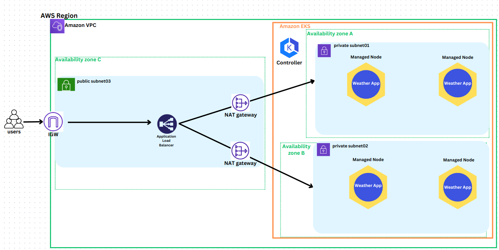
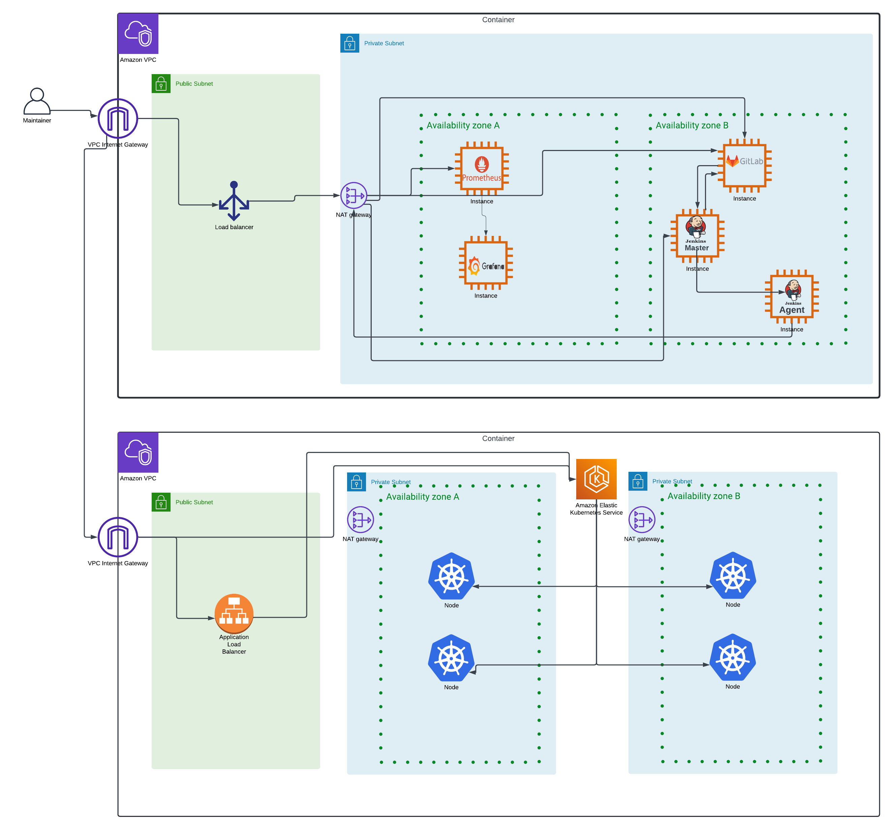

<!-- PROJECT LOGO -->
 

    

  <h1 align="center">Jenkins CI/CD Pipeline</h1>

  

    This repository contains the Jenkins pipeline script for automating the build, test, and deployment process of the Weather App. The pipeline is designed to be triggered by GitLab push events and updates version on merges.
    <!--  
    <a href="https://medium.com/@samsorrahman"><strong>Explore the docs »</strong></a>
     
     
    <a href="https://medium.com/@samsorrahman/list/90days-devops-journey-8a9e2568695a">View Demo</a>
    ·
    <a href="https://github.com/samsorrahman/90DaysOfDevOps-1/issues">Report Bug</a>
    ·
    <a href="https://github.com/samsorrahman/90DaysOfDevOps-1/issues">Request Feature</a> -->
  

<!-- TABLE OF CONTENTS -->

  
Table of Contents

  <ol>
    <li>
      <a href="#about-the-project">About The Project</a>
      <ul>
        <li><a href="#built-with">Built With</a></li>
      </ul>
    </li>
    <li><a href="#architecture">Architecture</a></li>
    <li><a href="#pipeline-stages">Pipeline Stages</a></li>
    <li><a href="#components">Components</a></li>
    <li><a href="#usage">Usage</a></li>
    <li><a href="#contact">Contact</a></li>

  </ol>

<!-- ABOUT THE PROJECT -->

## About The Project

The Weather App project aims to provide users with up-to-date weather information through an intuitive web application interface. Leveraging modern technologies such as Docker, Kubernetes, and GitLab CI/CD pipelines, the project streamlines the development, testing, and deployment processes, ensuring a seamless experience for both developers and end-users. With automated versioning, continuous integration, and deployment to Amazon EKS, the Weather App guarantees reliability, scalability, and performance. By centralizing version control on GitHub and utilizing Docker Hub for image distribution, the project fosters collaboration and simplifies the deployment lifecycle. All of the Infrastructure is deployed and managed using Terraform. Whether you're a developer contributing to the project or an end-user accessing weather data, the Weather App project promises efficiency, accuracy, and accessibility in delivering weather forecasts.

### Built With

- ![Linux][Linux]
- ![Git][Git]
- ![Python][Python]
- ![Docker][Docker]
- ![Jenkins][Jenkins]
- ![Kubernetes][Kubernetes]
- ![AWS][AWS]
- ![Terraform][Terraform]

(<a href="#readme-top">back to top</a>)

### Architecture

<!--  -->

(<a href="#readme-top">back to top</a>)

## Pipeline Stages

$`\textcolor{green}{\text{1. Checkout}}`$ : Clones the main branch of the Weather App repository from GitLab.

$`\textcolor{green}{\text{2. Versioning}}`$: Determines the new version based on the branch being merged and updates the version.txt file accordingly. It then commits the changes to the version control repository on GitHub.

$`\textcolor{green}{\text{3. Build}}`$: Builds the Docker image for the Weather App.

$`\textcolor{green}{\text{4. Test}}`$: Runs tests on the Dockerized Weather App to ensure its functionality.

$`\textcolor{green}{\text{5. Publish}}`$: Tags the Docker image with the appropriate version and publishes it to Docker Hub.

$`\textcolor{green}{\text{6. Deploy to EKS}}`$: Updates the Kubernetes configuration with the latest Docker image tag and applies the changes to the Amazon EKS cluster.

$`\textcolor{green}{\text{7. Cleanup}}`$: Removes the Docker image from the local Docker registry to free up space.

<!-- COMPONENTS -->

## Components

### Jenkins Server

- Purpose: Orchestrates the CI/CD pipeline.
- Configuration:
  - Plugins: Git, Docker, AWS, Kubernetes, Pipeline, Credentials Binding, GitLab.
  - Credentials:
    - GitLab Credentials (**'GIT_CREDENTIALS_ID'**): Used for committing and pushing version updates to the GitLab repository.
    - Docker Registry Credentials (**'docker-credentials-id'**): Used for pushing Docker images to the registry.
    - AWS Credentials (**'AWS_CREDENTIALS_ID'**): Used for accessing AWS resources.
    - Kubeconfig (**'KUBECONFIG_CREDENTIAL_ID'**): Used for accessing the EKS cluster.
    - Slack token (slack-token-id): Used for sending Slack notifications.

### GitLab Repository

- Repository URL: 'http://172.31.99.136/root/weather-app.git'
- Branches:
  - **'main'**: Main production branch.
  - **'dev'**: Development branch.
  - **'feature/\*'**: Feature branches.
  - **'hotfix/\*'**: Hotfix branches.
- Version File: **'version.txt'** located at the root of the repository, containing the version in **'MAJOR.MINOR.PATCH'** format.

### GitHub Repository for Versioning

- Repository URL: 'https://github.com/Zivgl66/version-control'
- Purpose: Stores the **'version.txt'** file to track the current version of the application independently of the main source code repository.
- Version File: **'version.txt'** located at the root of the repository, containing the version in **'MAJOR.MINOR.PATCH'** format.

### Docker

- Purpose: Containerizes the Weather App.
- Images: Built and pushed to a Docker registry.
- Registry: Defined in the **'DOCKER_REGISTRY'** environment variable.

### AWS EKS

- Purpose: Hosts the Kubernetes cluster where the Weather App is deployed.
- Configuration:
  - Cluster Name: Defined in the **'EKS_CLUSTER_NAME'** environment variable.
  - Region: Defined in the **'AWS_REGION'** environment variable.

### Slack

- Purpose: Sends notifications about the pipeline status.
- Configuration:
  - Slack Notification Plugin for Jenkins.
  - Slack Channels:
    - **succeeded-build**: Channel for successful builds.
    - **devops-alerts**: Channel for failed builds.
  - Message Formatting: Includes version information and build status.

<!-- USAGE -->

## Usage

To utilize the Weather App pipeline effectively, follow these steps:

### Prerequisites:

Ensure you have access to a Jenkins server with the necessary plugins installed.
Set up a Docker Hub account for publishing Docker images.
Configure an Amazon EKS cluster for deploying the Weather App.
Create repositories on GitLab and GitHub for version control.

### Configuration:

Set up Jenkins credentials for accessing GitLab, GitHub, and Docker Hub.
Update the pipeline script's variables (REGISTRY_URL, REGISTRY, DOCKER_IMAGE, GITHUB_CREDENTIALS_ID, GITHUB_REPO_URL) to match your environment.
Configure the AWS CLI with credentials for updating the Kubernetes configuration on Amazon EKS.

### Trigger:

The pipeline is triggered automatically upon GitLab push events to the main branch. Ensure that your GitLab repository is properly configured to trigger Jenkins builds.

### Notifications:

Customize the Slack channels and messages in the pipeline's post-build actions to receive notifications about build results (success or failure).
By following these usage instructions, you can effectively utilize the Weather App pipeline to automate the build, test, and deployment processes, ensuring a seamless and efficient development workflow.

(<a href="#readme-top">back to top</a>)

<!-- CONTACT -->

## Contact

Ziv Galitzer - zivgl66@gmail.com

<!-- Project Link:  -->

(<a href="#readme-top">back to top</a>)

<!-- MARKDOWN LINKS & IMAGES -->
<!-- https://www.markdownguide.org/basic-syntax/#reference-style-links -->

[Terraform]: https://img.shields.io/badge/terraform-%235835CC.svg?style=for-the-badge&logo=terraform&logoColor=white
[Terraform-url]: https://www.terraform.io/
[CSS-3]: https://img.shields.io/badge/css3-%231572B6.svg?style=for-the-badge&logo=css3&logoColor=white
[Python]: https://img.shields.io/badge/python-3670A0?style=for-the-badge&logo=python&logoColor=ffdd54
[GithubActions]: https://img.shields.io/badge/github%20actions-%232671E5.svg?style=for-the-badge&logo=githubactions&logoColor=white
[HTML]: https://img.shields.io/badge/html5-%23E34F26.svg?style=for-the-badge&logo=html5&logoColor=white
[AWS]: https://img.shields.io/badge/AWS-%23FF9900.svg?style=for-the-badge&logo=amazon-aws&logoColor=white
[Jenkins]: https://img.shields.io/badge/jenkins-%232C5263.svg?style=for-the-badge&logo=jenkins&logoColor=white
[Git]: https://img.shields.io/badge/git-%23F05033.svg?style=for-the-badge&logo=git&logoColor=white
[Linux]: https://img.shields.io/badge/Linux-FCC624?style=for-the-badge&logo=linux&logoColor=black
[Docker]: https://img.shields.io/badge/docker-%230db7ed.svg?style=for-the-badge&logo=docker&logoColor=white
[Kubernetes]: https://img.shields.io/badge/kubernetes-%23326ce5.svg?style=for-the-badge&logo=kubernetes&logoColor=white

